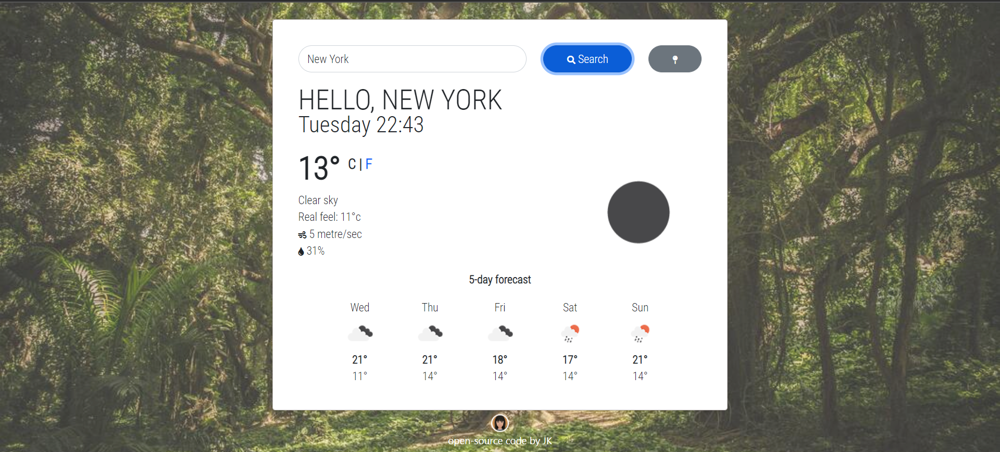

# Weather App 🌤
> A weather forecast web app.  
> Live demo [_here_](https://jkjkjk.netlify.app/).

## Table of Contents 🧾
* [General Info](#general-information)
* [Technologies Used](#technologies-used)
* [Features](#features)
* [Screenshots](#screenshots)
* [Project Status](#project-status)
* [Room for Improvement](#room-for-improvement)
* [Acknowledgements](#acknowledgements)
* [Contact](#contact)

## General Information
The goal of this project is to build a vanilla JavaScript weather forecast app, using OpenWeather API to display current weather information and fetch five-day forecast data. It also allows the user to enter the desired location. This app helps the user to better plan his/her schedule. 

## Technologies Used
- JavaScript
- Bootstrap
- HTML
- CSS

## Features
List the ready features here:
- Detects current location
- Current temperature display option in Celsius or Fahrenheit, plus weather details
- Five-day weather forecast

## Screenshots

## Project Status
Project is: _in progress_

## Room for Improvement
- Adding main toggle for unit conversion
- Five-day forecast in both unit measurements, in addition to Celsius
- Weather information (wind speed and real feel) available in imperial unit
- Add code comments

To do:
- Make web app responsive

## Acknowledgements
Give credit here.
- This README was inspired by [ritaly](https://github.com/ritaly)

## Contact
Created by [jiakjiak](https://jiakjiak.netlify.app/#contact) - feel free to contact me!
